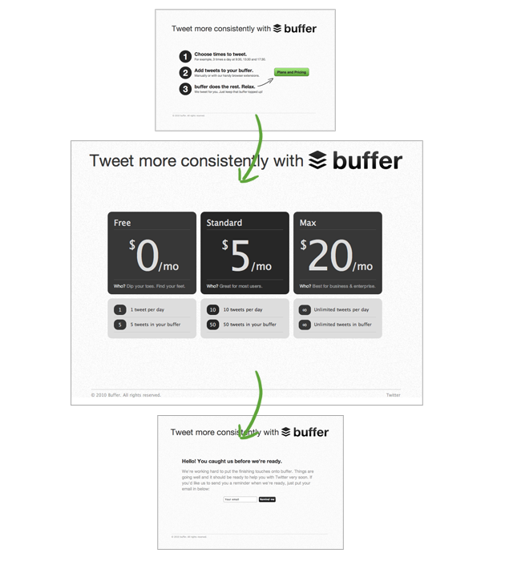
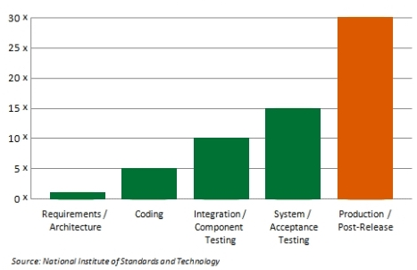
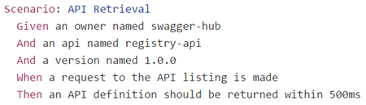
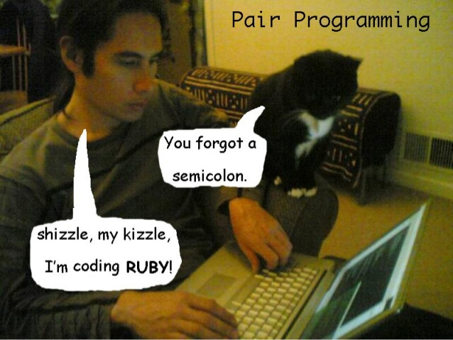
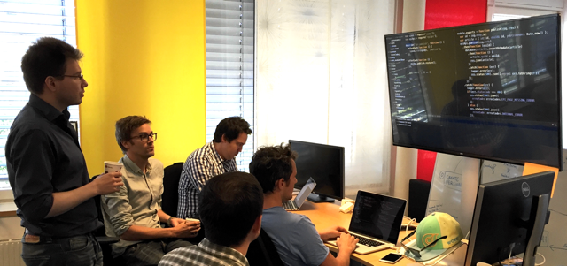
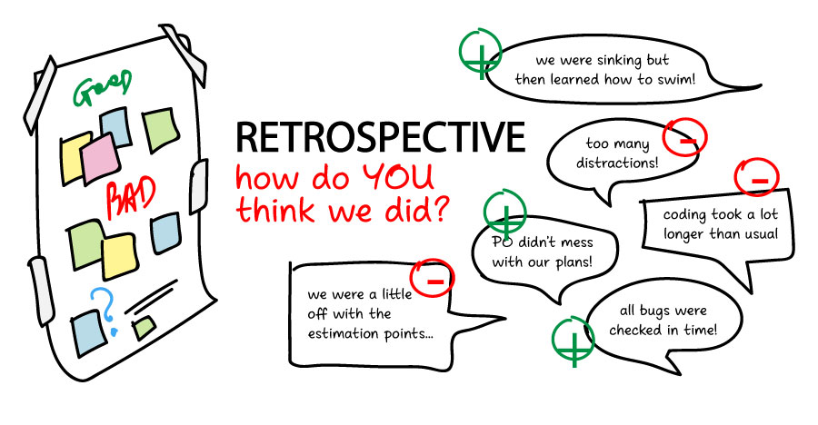
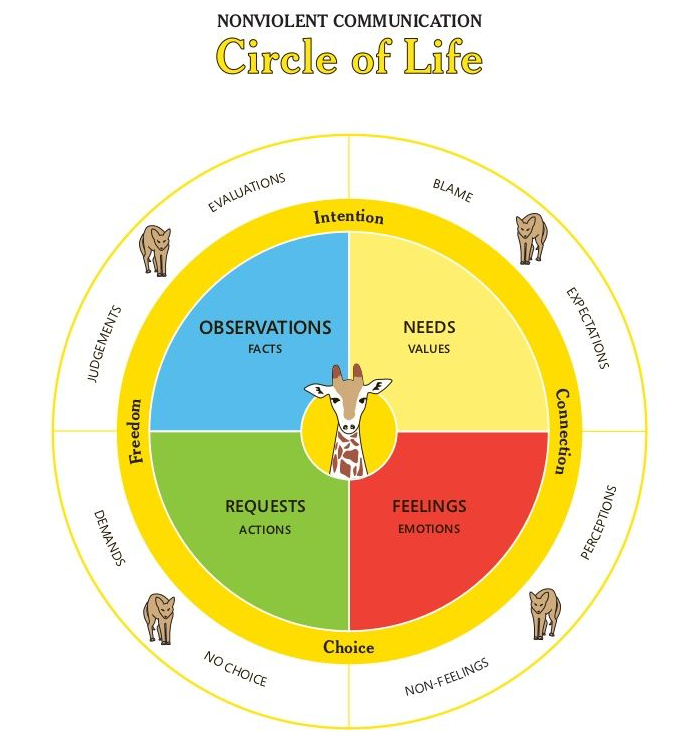

class: center, middle

# Make the right product, the right way with the right team
.octo-logo[]

---
class: center, middle

## The importance of feedbacks

.img-full-size[]

???

# TIBO

each project phases:
 - discussion for the problem
 - solution
 - link to feedback

---

## The speakers

.person[
.info[.name[Nicolas **Guignard**<br>].title[Software engineer @Octo]<br>@OCTODownUnder]
.pic[]
]
.person[
.info[.name[Thibaut **Gery**<br>].title[Software engineer @Octo]<br>@OCTODownUnder]
.pic[]
]

---
class: center, middle

## How do you make a product users need?


???

Problem:

 - Hey I got the best idea in the world, it's the next Facebook !!
 - how are you so sure
 - I know it's going to work just fine
 - How about we test that first?
 - Yeah you are right let's build it right now and we will see!

Solutions: MVP
 - get early feedback with the least amnout of energy/time/money
 - example: Dropbox create a video

---
class: center, middle
.left[
### [Lean] Buffer's MVP: landing page
]

.img-full-size[]

???
# TIBO
engage customer with landing but no product, got a few early adopters to talk to and get needs first

---

class: center, middle

## Is this technically doable?


???


Problem:

 - Hey Thibaut, I have tons of data in different databases that I would like to ingest in my datalake! But the compliance team preconize to use encryption from end to end and we don't have a lot of engineers.
 - Ok so you don't know if this is doable and which product on the market can do it?
 - Exact also I don't know if the design of my future architecture is what I need.
 - I am hesitating between two but I like one more.
 - How about we try the technology with one db first?

---

class: center, middle

.left[
## Proof of Concept
]

.img-full-size[]

???
# NICO


Solution: make a Proof Of Concept
- it helps to convince management that this is worthwhile to invest more heavily on a particuliar solution.
- try the technology, fail quickly, get feedbacks early, learn from it then be able to use what fits the best your needs.

---

class: center, middle

## How can I reduce the time spend on bugs?


???

Problem:

 - Hey Nick, I have an application in production since a bit of time and every time we develop a new feature.
 - Do you you spend a lot of time to fix bugs every time you implement anything?
 - Yes, and on some parts of the code it is too painful to test it.

---

class: center, middle
.left[
### [Craftsmanship] Unit tests
]

.img-full-size[]


???

# NICO

Solution:

 - Fix recurring bugs
 - To Fix the fact that you have tons of bugs to fix: add unit tests every time you have a bug
 - feedback
 - refactor

---

class: center, middle
.left[
### [Craftsmanship] Test Driven Development
]


???

# TIBO


Solution:
- As it is too hard to test, the code is probably too tightly coupled, functionalities are probably mixed and design might not be adequate.
- TDD will help to simplify solution, force dev to decouple the app components and make the app modular, design should emerge step by step.
- Force to divide big problems into smaller ones.
- We know a lot more quickly if a piece of code is working. Short-ciruit feedback loop.
- Tests are not influenced by implementation.

---

class: center, middle

## How is it possible to meet the expected requirements?


???

Problem:

 - Hey Thibaut, every time I develop a Jira ticket my business analyst are rejected even though I am certain beforehands that it is completed.
 - What happens? Features don't work? Or are there some misunderstanding?
 - Sometimes I think what I am doing is what is needed but it appears that I don't meet all the key details.
 - Do you have an easy way to find out what has been developped before ?
 - Actually it is also very hard because everything is dug into a long pile of Jira Tickets.

---

class: center, middle
.left[
### [Craftsmanship] Specification by example - ATDD
]

.img-full-size[]


???

# NICO

Solution:
- Specification by example
- ATDD / BDD
- Specs are up-to-date
- Avoid to have regression
- feedback quick and reliable when automated.

---
class: center, middle

## How to create team's standard?


--

```bash
clear;while x=0; do clear;date;echo "";echo "  [Count] | [IP ADDR]"; \
echo "-------------------";netstat -np|grep :80|grep -v LISTEN \
|awk '{print $5}'|cut -d: -f1|uniq -c; sleep 5;done
```
> Displays the quantity of connections to port 80 on a per IP basis

???

# NICO

Problem:
 - We hired this expert last month but he's writing code that is super good but super hard to understand.
 - what do you mean?
 - lately he has written an bash oneliner for a story which is pretty cool but...
 - intercept bug
 - maintenability/readability
 - what happen if the expert is not here (bus faxtor)

**easrly code feedback**

---

class: center, middle

.left[
### [Craftsmanship] Code Review
]

.code-review-commic[]


???

# NICO

What is nice code? **diff for everyone**:
 - agreed
 - create it
 - respect it


## feedback on the code:
 - readability / maintenability
 - reduce bugs


---
class: center, middle
.left[
### [Craftsmanship] Team Review
]
.img-full-size[]

---
class: center, middle

## How to grow as a developer?


--

```bash
clear;while x=0; do clear;date;echo "";echo "  [Count] | [IP ADDR]"; \
echo "-------------------";netstat -np|grep :80|grep -v LISTEN \
|awk '{print $5}'|cut -d: -f1|uniq -c; sleep 5;done
```

???

# TIBO

- but I kinda want to be able to write those one liners?
- like... really ?!?!?!
- Yes

---
class: center, middle
.left[
### [Craftsmanship] Pair programming
]
.img-full-size[]

???

When coding:
 - instead feedback on your code by some else => make sure you're code is readable or functional

When assisting
 - learning from the other person:
 - what is this super sweet hotkey to extract a method in IDEA
 - what is this pattern you are using?

---
class: center, middle
.left[
### [Craftsmanship] Mob programming
]
.img-medium-size[]


???
exactly the same by getting feedback from more people.
---

class: center, middle

## How to make sure we are still building the app our user wants


???
 - I just build this AMAZING feature, from heaps of data I recommend the best choice for the next purchase, the code is so neat: it has been review by the tech lead, the performances are great!
 - Do you know if your recommendation feature is used by your user?
 - What do you mean.
 - It's one thing to build your feature the right way, it must be the right feature
 - I hate you mate...


---
class: center, middle
.left[
### [Lean] Data Driven
]
.img-full-size[]

???
# NICO

track your user behaviour with metrics:
 - google anaylitics
 - track if the user click on the recommendation or even better, did he actually bough the item.

Even if it is used, can the experience of the user be expected ?
---
class: center, middle
.left[
### [UX] User Testing
]
.img-medium-size[]

???

# TIBO
 - watch your user
 - don't alter the User experience by giving indication (quantic photon physic's anecdote)

---

class: center, middle

## How to speed up the user feedback?


???

 - it still take months to test with our feature with our user
 - why...
 - we must deploy it in production and it takes too much time
 - Have you heard about the devops principles?
 - Oh? We are already devops, we are using AWS and we are putting all our apps in containers.
 - let's have a look on wikipedia


---

class: middle
.top[
### [Agile] Principles
]

> Our highest priority is to satisfy the customer
through early and continuous delivery
of valuable software.

--

.img-small-size[]

---

class: middle
.top[
### [Devops] Release often
]
> DevOps is a software engineering practice that aims at unifying software development (Dev) and software operation (Ops). The main characteristic of the DevOps movement is to strongly advocate automation [...]. **DevOps aims at shorter development cycles, increased deployment frequency, more dependable releases, in close alignment with business objectives.**


???

**Reducing the user feedback loop**
---
class: center, middle

## How can we learn from the previous releases?


???

 - Okay : now we release often but every time we have the same issues : code, deployment, processes...
 - what do you mean ? Don't you try to learn every time?
 - well when I see something that I can have impacts on I try to do it but that's all.
 - Have you heard about retrospectives ? this could be a way to make things better.

---
class: center, middle
.left[
### [Agile] Retrospective
]
.img-medium-size[]

???
Solution:
- talk about how the last release went.
- take actions on some selected key points agreed by the team

---
class: center, middle
## How to solve issues between two individuals?


???

# TIBO
Problem:

 - hey the devops guy just called and ask why it's a not a Java application, but 23 micro-services?
 - Oh it's because I started to rewrite this critical part in RUST so it can be fast for our customer. I get shit done.
 - Yes but no one can understand it, no one can maintain it and people are struggling to deploy it
 - yes but the experience is better for our customer, plus Rust is DOPE. Actually we should rewrite everything in RUST.
 - ...
 - Actually JS is a useless language. Let's rewrite everything in Elm, I have read so many success story on Medium and HN.

 He's going to kick my ass...

Solutions: apply Non violente communication


---
layout: true
class: center, middle, non-violent-slide
.left[
### Nonviolent Communication
]

.non-violent-pic[]


???

# TIBO

---


---
count: false


> You are an assh*le

---
count: false

> ~~You are an assh*le~~

---
count: false


> I felt you broke the team's trust,


---
count: false

> When you introduced RUST without telling anyone in the team,

> I felt you broke the team's trust,

---
count: false

> When you introduced RUST without telling anyone in the team,

> I felt you broke the team's trust,

> We expect much more from a senior

---
count: false

> When you introduced RUST without telling anyone in the team,

> I felt you broke the team's trust,

> ~~We expect much more from a senior~~

---
count: false

> When you introduced RUST without telling anyone in the team,

> I felt you broke the team's trust,

> I need to be able to trust you,

---
count: false

> When you introduced RUST without telling anyone in the team,

> I felt you broke the team's trust,

> I need to be able to trust you,

> Next time you need to share your idea with the team

---
count: false

> When you introduced RUST without telling anyone in the team,

> I felt you broke the team's trust,

> I need to be able to trust you,

> Next time you ~~need to~~ share your idea with the team

---

count: false

> When you introduced RUST without telling anyone in the team,

> I felt you broke the team's trust,

> I need to be able to trust you,

> Next time you **should**  share your idea with the team


---
class: middle, center
layout: false

# Get feedback at every level, at every stage, quickly

---
class: middle, center
count: false


# Get feedback **at every level**, at every stage, quickly

---
class: middle, center
count: false


# Get feedback at every level, **at every stage**, quickly

---
class: middle, center
count: false

# Get feedback at every level, at every stage, **quickly**
